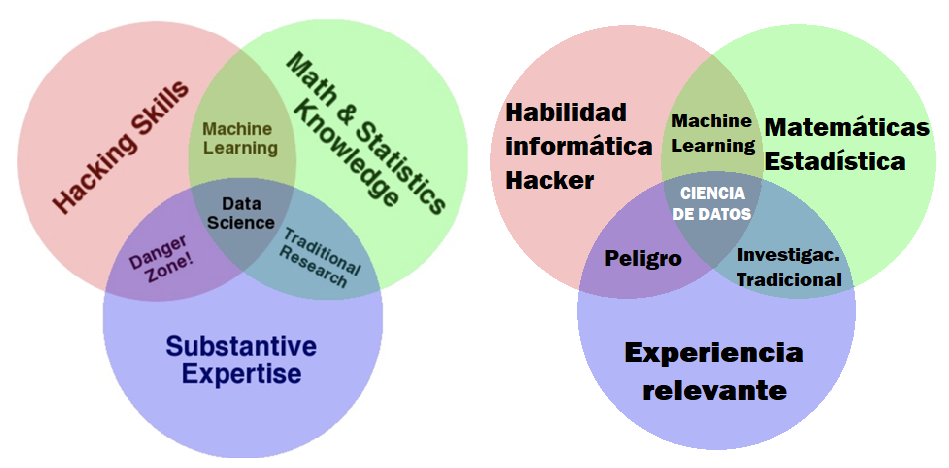

#INTRODUCTION

Big data technologies allow companies to extract value from their data to detect opportunities, optimize processes, and improve decisions, provided that analysis and modeling techniques specific to the work of a data scientist are applied.

The idea of ​​the diagram is to show the interdisciplinarity inherent in the work of the data scientist.

##THE THREE SKILL GROUPS

| KNOWLEDGE OF STATISTICS AND MATHEMATICS | KNOWLEDGE OF INFORMATION TECHNOLOGIES | KNOWLEDGE OF SPECIFIC BUSINESS AREAS OR DOMAINS |
|-----------|-----------|-----------|
| Dato 1    | Dato 2    |
